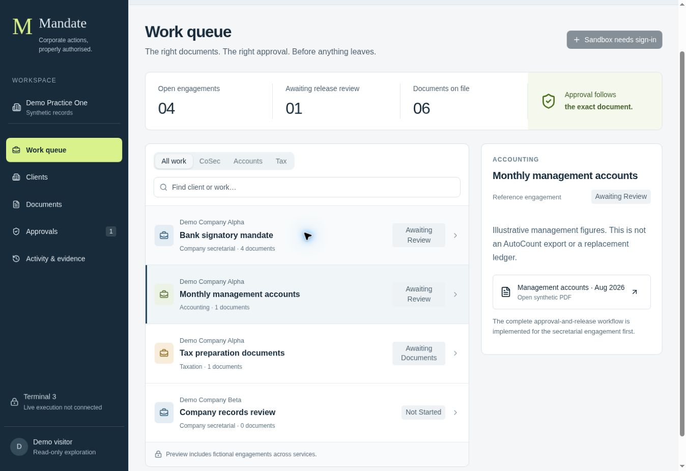

# Mandate

**Corporate actions, properly authorised.**

Mandate helps professional practices review the right client document, bind approval to its exact version, and stop an action when its authority or scope changes. It sits alongside AutoCount, Excel and existing practice systems.

**Current status: working prototype; not submission-ready.** The application builds and its HTTP/SQLite control tests pass. Public hosting was blocked by the account’s new-site limit. Terminal 3 keys were unavailable, so live provider authentication and delivery are not verified. No live URL or video is claimed.



## Start here

- [Run and deploy](docs/deployment.md)
- [Architecture and data flow](docs/architecture.md)
- [Security and GATE controls](docs/security.md)
- [Actual test evidence](docs/evidence.md)
- [Demo flow and three-minute video plan](docs/demo.md)
- [Build log](docs/build-log.md)
- [Independent review brief](docs/reviewer-brief.md)
- [Synthetic dataset and PDFs](demo-data/README.md)

This repository is intended to be the complete judge-facing entry point. No Notion account is required to understand the product or its limitations.

## The problem

A company secretary receives a banking package. A source record authorises A and B jointly. A reviewer approves one PDF and one recipient. Later somebody changes the terms, adds C, or changes the destination. A normal task-completion checkbox does not tell the release agent whether the exact action is still authorised.

Mandate binds that approval to the complete action snapshot and checks it again at execution. The professional establishes business authority; deterministic application rules enforce the approved scope. Agent identity is a separate control.

## What runs

| Capability | Implemented and checked | Remaining |
|---|---|---|
| Workspace | Client register, scoped work queue, service filters, version comparison, actual synthetic PDFs | Real client pilot and user feedback |
| Authority and approval | Source review, different reviewer identity, exact SHA-256 binding, expiry and changed-snapshot rejection | Two-person hosted browser validation |
| Isolation | Server membership checks on documents, commands, views and exports | Hosted gateway/isolation verification |
| Persistence | D1 SQL aggregate/membership model, versioned migration, R2 byte/hash adapter | Provisioned production D1/R2; backup and restore |
| Internal sandbox | Atomic receipt and activity save; duplicate request returns existing receipt | External receiver and distributed reconciliation |
| Terminal 3 | SDK 5.11.0 imports successfully; separate Node authentication adapter; application fails closed | Keys, live authentication, agent identity/credits, outbound grant, TEE contract and real receiver |
| Accounting and tax | Synthetic reference documents and access boundaries | Complete service workflows; no AutoCount API integration |
| Demo and docs | Reproducible source, fixture pack, control tests, recording plan | Public repository, live URL, ≤3-minute YouTube video and submission |

There is no general file upload, statutory filing, legal deadline calculation, tax computation or LLM authorisation in this build. Internal sandbox records are not Terminal 3 attestations or external deliveries.

## Sixty-second exploration

1. Open Alpha’s **Bank signatory mandate** in Work queue.
2. Open the original v1 PDF and note its file hash.
3. Compare v2: same A+B, different terms and hash. Compare v3: C is added.
4. Open **Authority** to see the required independent source review.
5. Open **Release** for exact recipient, mode, approval and expiry.
6. Open **Activity & evidence**. It starts empty; actual actions populate it.

Anonymous local preview is read-only. After a trusted deployment, a preparer creates an isolated synthetic workspace and invites a separate reviewer. See the complete two-person flow in [demo.md](docs/demo.md).

## Reproduce

Node 24+ and the shell utilities described in deployment.md are required.

```bash
npm ci
npm run typecheck
npm test
npm run build
npm run dev
```

The tests execute the actual HTTP handler and prepared SQL against Node SQLite with explicit test identities and a test file adapter. They are not proof of a live sign-in or provider call. The build emits a Cloudflare-compatible Worker plus client assets.

The Terminal 3 adapter is an isolated package under `integrations/terminal3`. Its inspect command tests SDK imports. Its check command requires a real server-side key and exits with NOT RUN when one is absent. It is not wired to the release route.

## Privacy and claims

All companies, people, figures and documents are wholly invented. No real Macro client report was used. Example emails are not delivery addresses. There is no bank, regulator, payment or AutoCount connection. Do not claim SSM endorsement, legal validity, an immutable audit trail, compliance certification or enterprise production readiness.

Designed around Caroline Ang’s company-secretarial and governance practice experience. Macro provides company-secretarial, accounting and tax services. External practitioner/Claude/Perplexity validation is pending for this code build.

## Submission checklist

The user-supplied deadline is **8 September 2026, 8 pm Malaysia time**. Required: participant’s name, email, contact number, **public GitHub repository**, and a **YouTube demo no longer than three minutes**. The form has not been submitted. The event is the Terminal 3 ADK AI Tinkerers Kuala Lumpur build night; older Convex All Gas criteria are not being presented as this event’s rules.

Record the final submitted commit and place the verified live and video links near the top only when they exist. Application reuse licence has not been selected; third-party packages retain their own licences.
