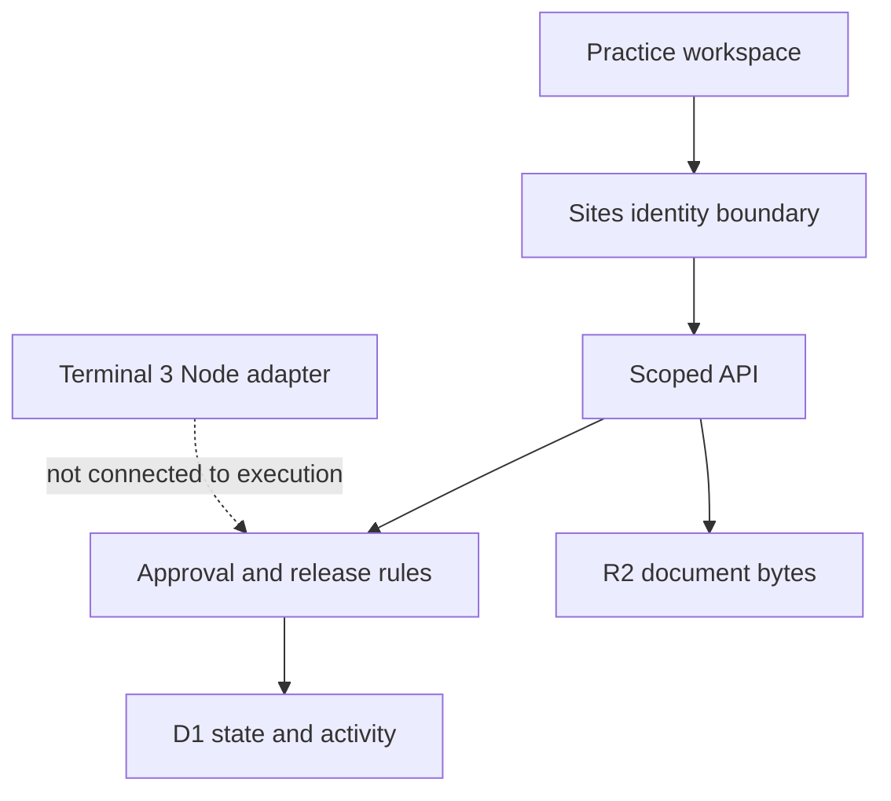

# Mandate architecture

The first implementation is a modular monolith: React/TypeScript interface, Vinext Worker routes, a domain policy module, prepared D1 SQL, and private R2 document objects. Terminal 3 is isolated in a separate plain Node package because its WASM loader is not verified in the Worker runtime.

## Product boundary

User and first prospective buyer: a private professional practice delivering secretarial, accounting and taxation services. Macro’s current workflow uses AutoCount, Excel and manual coordination. Mandate addresses professional review and controlled document handling; it does not replace the ledger or submit statutory filings.

The first complete business-rule flow is the Alpha secretarial engagement. Accounting and tax provide separately scoped reference documents. No statutory calendar or tax calculation is activated. No client data is accepted in this build.

## Data model and authorisation

`workspaces`: one isolated synthetic workspace per owner identity, a versioned JSON aggregate and optimistic revision. `memberships`: explicit user, workspace, engagement and role. `invitations`: email-bound, hashed, expiring, single-use reviewer invitations.

An aggregate holds companies, engagements, versioned document metadata, source review, one release request, its exact approval and bounded activity history. An aggregate keeps a sandbox receipt and its activity record in one atomic compare-and-swap update. This is a prototype persistence choice, not a claim of high-volume scalability. Production should normalise high-volume events and workflow entities and define retention, recovery and archival operations.

Every protected API resolves membership before loading protected workspace state. Responses and exports filter by assigned engagement. Knowing a company ID or a document ID does not establish permission. Uploaded fixture keys include workspace, engagement, document ID and hash. Bytes are verified on read and before review or execution.

## Authentication

The Sites dispatcher supplies authenticated identity headers. The route uses the starter’s `getChatGPTUser()` helper and the stable `oai-authenticated-user-id`. `MANDATE_AUTH_MODE=sites-dispatch` must be explicitly configured after deployment behind the trusted dispatcher. Otherwise write access is disabled. Headers from the public internet are not an authentication system: do not deploy this route directly on another platform without replacing this boundary with verified sessions/JWTs and protecting the origin.

The creator is assigned the preparer role for Alpha secretarial only. A different signed-in identity may accept an invitation bound to its email and becomes a reviewer only for that engagement. Successful login alone does not grant access to somebody else’s workspace. The implementation cannot establish that two accounts belong to two different natural persons; practitioner testing remains necessary.

## Approval binding

The approval digest covers workspace/tenant, company, engagement, request ID, source ID/hash/revision/expiry/reviewer, document ID/version/hash/signatories, action, destination, execution mode, agent identity, policy version and approval expiry. A source review lasts one hour; a release approval lasts at most thirty minutes and never outlives the source review. These are demonstration policy durations, not legal deadlines.

The reviewer cannot be the preparer. Only A and B jointly are permitted in the fixture. Changes retain historical approval data but mark the request as needing review; final execution recomputes and compares the digest. File bytes, source validity, policy, current membership and approval are checked at the record boundary. An old workspace revision fails with 409.

## Effects and integrations

The implemented effect is an **internal sandbox record** saved in the same aggregate transaction. No document is sent to an external party. A repeated completed request retrieves its existing receipt; the API’s stale-version response requires a refresh after an uncertain response. This does not establish external receiver idempotency.

Terminal 3 mode returns a clear 503 and writes a blocked-attempt event after business checks. The Node adapter imports SDK 5.11.0 and implements the official testnet handshake/authentication sequence. Its exports have been inspected in Node. Live authentication, separate agent registration/credits, a scoped outbound grant, a TEE contract, a private receiver and receiver-side reconciliation still need implementation and verification. No DID or proof is invented.

A language model is not required for the implemented deterministic workflow. There is no claim that an LLM has drafted or authorised these documents.
