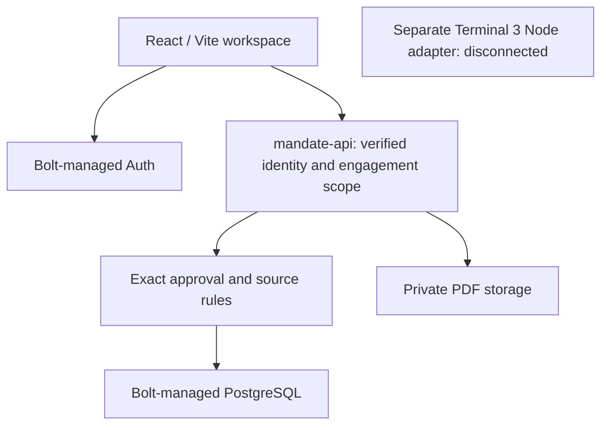

# Mandate architecture

React 19 and Vite render the workspace. Bolt-managed Auth validates sessions; the Deno mandate-api server function verifies identity and confirmed email before protected operations. It calls trusted-server PostgreSQL functions and private document storage through Bolt's managed backend. No separate Supabase project was provisioned.

The client receives only engagements assigned to its authenticated identity. The anonymous preview is an allowlisted synthetic seed. Workspaces, memberships and invitations are accessed through server-filtered operations; ordinary clients must not access or mutate arbitrary aggregate state. Private PDF bytes are hash-checked before review and internal recording.

An approval binds workspace, company, engagement, request, source/hash/revision/reviewer/expiry, document/version/hash/signatories, recipient, action, mode, agent and policy version. The preparer cannot approve their own request. Distinct account IDs alone do not prove distinct natural persons.

The implemented effect is an internal sandbox receipt and activity record, with revision and duplicate-effect checks. Hosted concurrent-release verification is incomplete; see the evidence record. A timeout is not successful concurrency proof.

Terminal 3 stays separate and disconnected. SDK trust-manifest verification currently fails before authentication. No external bank, email, payment, regulator, AutoCount or receiver integration is active. Accounting and taxation are illustrative, isolated engagement fixtures.

[Historical Cloudflare architecture](baseline/build01-architecture.md) is preserved as baseline history, not current deployment instructions.
